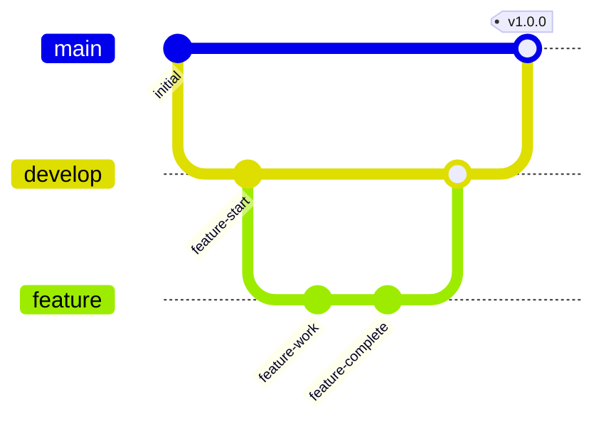

Contributing to Kathanika
=========================================

Thank you for your interest in contributing to the Library Management System project! Here are some guidelines to help you get started.

Getting Started
---------------

1.  Fork the repository on GitHub.
2.  Clone your forked repository to your local machine.
3.  Build the project and make sure it runs without errors.
4.  Familiarize yourself with the codebase and the project architecture.

How to Contribute
-----------------

Here are some ways you can contribute to the project:

-   Report bugs and suggest enhancements: If you find a bug or have an idea for an enhancement, please [open an issue](https://github.com/hard-rox/kathanika/issues/new) on GitHub.
-   Submit pull requests: If you have a fix for a bug or an implementation for an enhancement, please submit a pull request. Here are the steps:
    1.  Create a new branch on your local machine for your changes.
    2.  Make your changes and commit them with a descriptive commit message.
    3.  Push your branch to your forked repository.
    4.  Open a pull request from your branch to the main repository.
    5.  Wait for feedback and address any comments or suggestions.

Development Workflow
--------------------

### Branch Strategy
- `main`: Production-ready code
- `develop`: Integration branch for features
- `feature/*`: Individual feature branches

### Development Process
1. Create a feature branch from `develop`
2. Implement your changes
3. Write tests and ensure all tests pass
4. Submit a pull request to `develop`
5. After review and approval, your changes will be merged

Code Style
----------

We follow the C# coding conventions and guidelines as outlined in the [Microsoft .NET Coding Conventions](https://docs.microsoft.com/en-us/dotnet/csharp/fundamentals/coding-style/coding-conventions) documentation. Here are some additional guidelines to follow:

-   Use meaningful and descriptive names for variables, functions, and classes.
-   Keep functions small and focused.
-   Write clear and concise comments to explain your code.

Testing
-------

All pull requests must include tests to ensure that the code changes do not introduce new bugs or regressions. We use xUnit for unit testing, and MongoDB for integration testing.

Code Review
-----------

All pull requests will be reviewed by one or more maintainers before they are merged. Please be patient and responsive during the review process, and be open to feedback and suggestions.

License
-------

By contributing to this project, you agree that your contributions will be licensed under the [MIT License](https://github.com/hard-rox/kathanika/LICENSE).