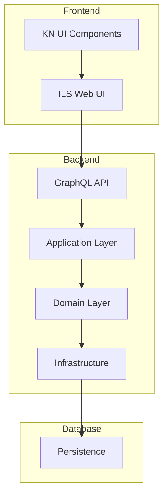

Architecture Document
=====================

Introduction
------------

This document describes the architecture of the project and provides an overview of the key components, layers, and interactions between them.

Architecture Overview
---------------------

The project follows a CQRS architecture with a separate domain and application layer. The domain layer contains the business logic of the application, while the application layer contains the commands and queries that the application will execute.

The project also includes infrastructure layers for GraphQL, persistence, and services, as well as a separate tests folder for automated testing.

Layers
------

### Application

The application layer contains the commands and queries that the application will execute. The layer is responsible for executing the business logic defined in the domain layer and interacting with the infrastructure layer. The `Commands` and `Queries` subfolders contain the command and query objects, respectively.

### Domain

The domain layer contains the business logic of the application. It is responsible for defining the domain objects, including entities, value objects, and aggregates, as well as the repository interfaces used to persist the data. The `Aggregates`, `Entities`, `Primitives`, `Repositories`, and `ValueObjects` subfolders contain the domain objects and interfaces.

### Infrastructure.GraphQL

The infrastructure layer for GraphQL contains the GraphQL schema, resolvers, and types. It is responsible for handling incoming GraphQL queries and mutations, as well as executing the appropriate commands and queries from the application layer.

### Infrastructure.Persistence

The infrastructure layer for persistence is responsible for implementing the repository interfaces defined in the domain layer. It provides an implementation of the repository interfaces using a persistence technology, here MongoDB.

### Infrastructure.Services

The infrastructure layer for services contains various services and implementations that do not fit into the other categories. This could include external APIs, messaging services, email services, caching services, and more.

### Tests

The tests folder contains automated tests for the application. It is structured to mirror the directory structure of the application and includes unit tests for the domain layer, as well as integration tests for the application layer.

### Web

The web folder contains the entry point for the application, such as the ASP.NET Core startup class. The `Properties` subfolder contains project-specific settings and metadata.

Technologies Used
-----------------

-   C#
-   .NET 7
-   GraphQL
-   MongoDB
-   xUnit

Deployment
----------

The application can be deployed to any hosting environment that supports .NET Core. The application uses MongoDB for persistence.

Development Practices
---------------------

-   Test-driven development (TDD) is used to ensure high code quality and prevent regressions.
-   Continuous integration (CI) is used to automatically build and test the application on each commit.
-   Version control (Git) is used to manage changes to the codebase.

Conclusion
----------

This document has provided an overview of the architecture of the project, including its layers, components, and technologies. The project follows a CQRS architecture with a separate domain and application layer, and includes infrastructure layers for GraphQL, persistence, and services, as well as a separate tests folder for automated testing.

This architecture provides a clear separation of concerns, making it easier to maintain and extend the application over time. The use of DDD principles and CQRS pattern ensures that the business logic of the application is well-defined and that changes to the application are made in a controlled manner. The use of automated testing ensures that changes to the application are thoroughly tested and that the application remains reliable and resilient.

System Architecture
-------------------

This document describes the architectural design of Kathanika Library Management System.

### High-Level Architecture Diagram

### Layer Details

#### Frontend Layer
- **ILS Web UI**: Main web interface for library staff and users
- **KN UI Components**: Reusable UI component library

#### Backend Layer
- **GraphQL API**: API gateway handling all client-server communication
- **Application Layer**: Business logic and application services
- **Domain Layer**: Core domain models and business rules
- **Infrastructure**: Cross-cutting concerns and external service integrations

#### Database Layer
- **Persistence**: Data storage and retrieval layer

### Communication Flow
1. Client requests flow through the ILS Web UI
2. Requests are formatted as GraphQL queries/mutations
3. Application layer processes the business logic
4. Domain layer ensures business rules
5. Infrastructure layer handles persistence and external services
