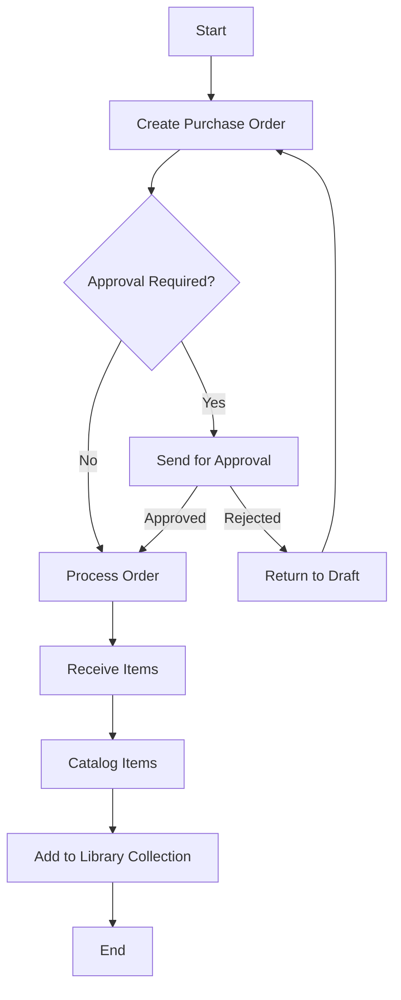
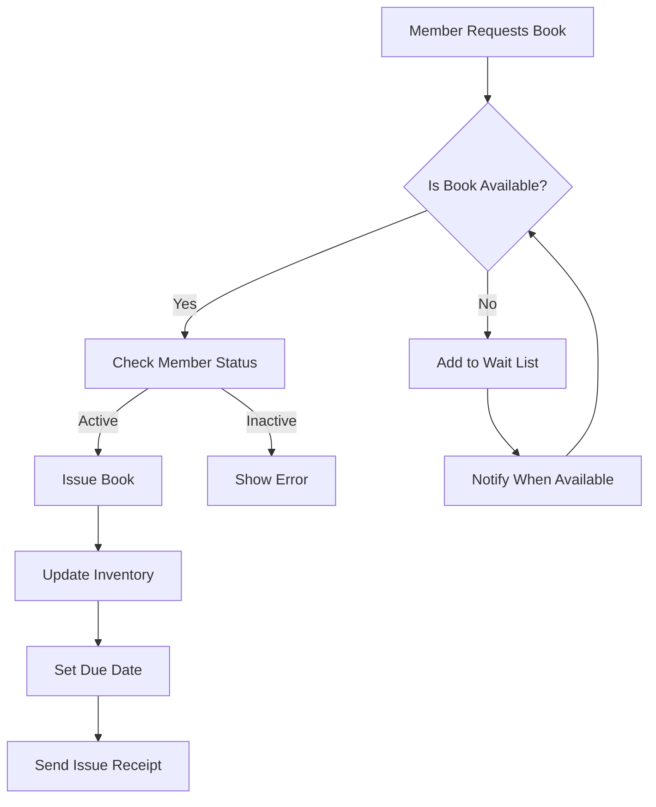
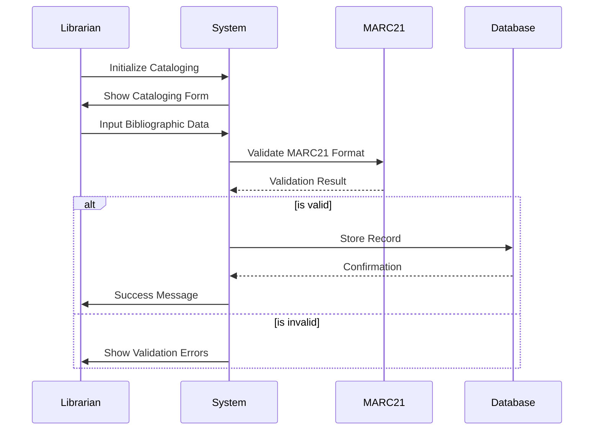
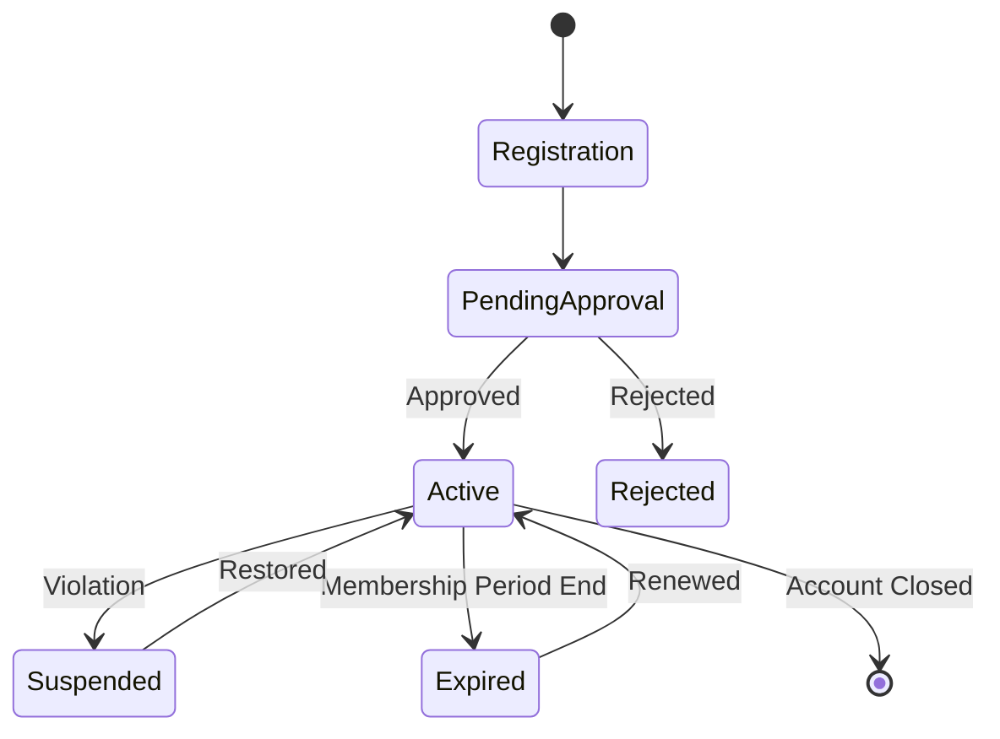

# Kathanika Workflow Diagrams

This document contains the key business workflow diagrams for the Kathanika Library Management System.

## Core Workflows

### Book Acquisition Flow

### Circulation Flow

### Cataloging Flow

### Member Management Flow

## Note
These diagrams represent the high-level business workflows in Kathanika Library Management System. The actual implementation might have additional steps and error handling mechanisms. For technical architecture and development workflows, please refer to:
- System Architecture: [architecture.md](architecture.md)
- Development Guidelines: [CONTRIBUTING.md](../CONTRIBUTING.md)
